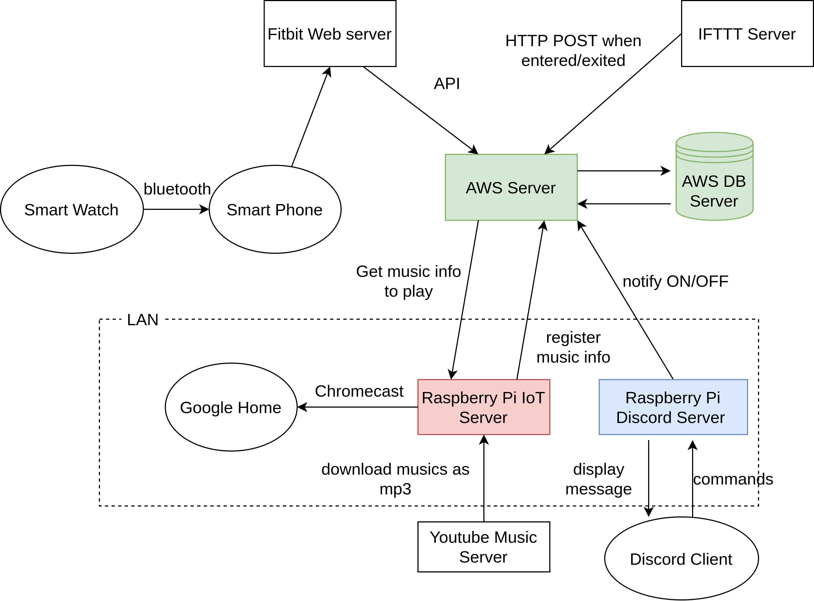

# Smart Watch IoT Server

This is an application that acquires your heart rate with a smartwatch, and recommends and plays back the appropriate BPM according to your heart rate.

The colored servers in the figure below are constructed.
The URLs of each repository are as follows.

- **(This repository) AWS server** (https://github.com/ITK13201/smart-watch-iot-server)
- Raspberry Pi IoT Server (https://github.com/ITK13201/smart-watch-iot-client)
- Raspberry Pi Discord Server (https://github.com/ITK13201/smart-watch-iot-interactive-server)



## Install

- docker
- docker-compose

## Setup

### 1. Clone

```shell
git clone git@github.com:ITK13201/smart-watch-iot-server.git
cd smart-watch-iot-server
```

### 2. Init environments

```shell
./scripts/environment/init.sh
```

### 3. Obtain the Fitbit token

1. create a new application at https://dev.fitbit.com/apps/new and set up OAuth 2.0 authentication.
2. refer to https://dev.fitbit.com/build/reference/web-api/developer-guide/authorization/ to obtain an access token.
3. Add the obtained access token (which should be returned in json format) to the `./docker/backend/conf/fitbit.tok`.


### 4. Build

```shell
docker-compose build
```

## Usage

### Start container

```bash
docker-compose up -d
```

### Stop container

```bash
docker-compose down
```

### Logging

```bash
docker-compose logs -f
```

### Migrate

```bash
docker-compose exec app python manage.py migrate
```

### Create superuser

```bash
docker-compose exec app python manage.py createsuperuser
```
